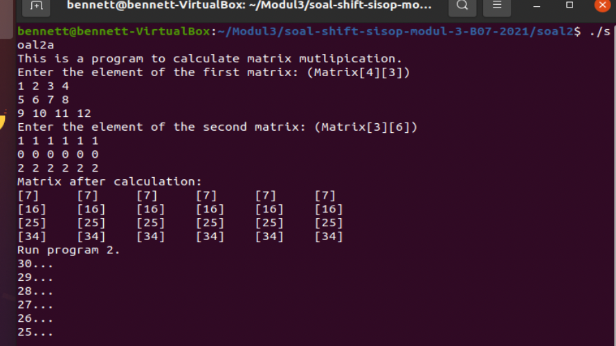
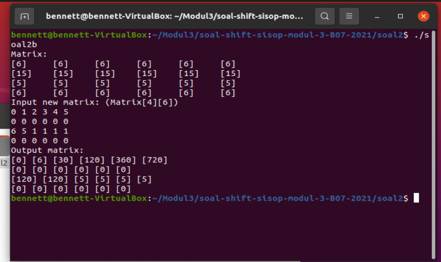

# soal-shift-sisop-modul-3-B07-2021
## Anggota Kelompok
* Christian Bennett Robin 05111940000078
* Zelda Elma Sibuea 05111940000038
* Hanifa Fauziah 05111940000024

## Soal 1
Keverk adalah orang yang cukup ambisius dan terkenal di angkatannya. Sebelum dia menjadi ketua departemen di HMTC, dia pernah mengerjakan suatu proyek dimana keverk tersebut meminta untuk membuat server database buku. Proyek ini diminta agar dapat digunakan oleh pemilik aplikasi dan diharapkan bantuannya dari pengguna aplikasi ini. 

### 1A ###
Pada saat client tersambung dengan server, terdapat dua pilihan pertama, yaitu register dan login. Jika memilih `register`, client akan diminta input id dan passwordnya untuk dikirimkan ke server. User juga dapat melakukan login. `Login` berhasil jika id dan password yang dikirim dari aplikasi client sesuai dengan list akun yang ada didalam aplikasi server. Sistem ini juga dapat menerima multi-connections. Koneksi terhitung ketika aplikasi client tersambung dengan server. Jika terdapat 2 koneksi atau lebih maka harus menunggu sampai client pertama keluar untuk bisa melakukan login dan mengakses aplikasinya. Keverk menginginkan lokasi penyimpanan id dan password pada file bernama **akun.txt**.

**Penyelesaian**

Pada soal ini diminta untuk membuat program yang bisa menyambungkan antara server dengan client dimana client bisa melakukan login dan juga register.
Pada fungsi Register, diawali dengan dikirim send yang akan diterima oleh server yang berisi "register" gunanya agar server mengetahui perintah apa yang diminta oleh user. Lalu server akan membaca buffer yang berisi register tersebut dan mengirimkan kepada client bahwa perintah yang diminta telah diterima. Lalu pada client diminta untuk memasukkan username dan password dengan format yang sesuai. Username dan password tersebut akan di kirim ke server. Server menerima, dan menjalankan perintah untuk menulis inputan tersebut ke akun.txt. Setelah ditulis, maka server akan menyuruh disisi client untuk menampilkan 'Register Succes'.

**Hasil**


Pada fungsi Login, diawali dengan pembacaan inputan dari user dibagian client, ketika membaca kata `login` maka server menerima perintah tersebut dan melakukan hal yang seharusnya dia lakukan. Yaitu dibagian client akan diminta untuk memasukkan username dan password. Lalu inputan akan dibandingkan dengan yang ada didalam file akun.txt yang berisikan list dari username dan password user yang telah melakukan register. Apabila inputan dengan yang ada di akun.txt sama, maka disisi Server akan menganggap login berhasil dan melakukan send ke bagian client. Dimana di bagian client akan ditampilkan bahwa Login Success. Lalu, disisi client akan ditampilkan menu utama berupa list perintah untuk mengotak-atik database yang ada di folder `Files`. 

**Hasil**


Disini menggunakan thread untuk dapat memungkinkan terjadinya lebih dari 1 koneksi Client ke Server.
```c
while(true) {
        if ((new_socket = accept(server_fd, 
            (struct sockaddr *) &address, (socklen_t*) &addr_len)) < 0) {
            perror("accept");
            exit(EXIT_FAILURE);
        }
        pthread_create(&(tid[total]), NULL, &client, &new_socket);
        total++;
    }

```

**Hasil**


### 1B ###
Sistem memiliki sebuah database yang bernama files.tsv. Isi dari files.tsv ini adalah path file saat berada di server, publisher, dan tahun publikasi. Setiap penambahan dan penghapusan file pada folder file yang bernama  FILES pada server akan memengaruhi isi dari files.tsv. Folder FILES otomatis dibuat saat server dijalankan. 

### 1C ###
Tidak hanya itu, Keverk juga diminta membuat fitur agar client dapat menambah file baru ke dalam server.
```
File1.ekstensi
File2.ekstensi
```
Pertama client mengirimkan input ke server dengan struktur sebagai berikut :
Contoh Command Client :
```
add
```
Output Client Console:
```
Publisher:
Tahun Publikasi:
Filepath:
```

Kemudian, dari aplikasi client akan dimasukan data buku tersebut (perlu diingat bahwa Filepath ini merupakan path file yang akan dikirim ke server). Lalu client nanti akan melakukan pengiriman file ke aplikasi server dengan menggunakan socket. Ketika file diterima di server, maka row dari files.tsv akan bertambah sesuai dengan data terbaru yang ditambahkan.

**Penyelesaian**

Pada awalnya client akan membuat file dimana file tersebut akan dibuka dan itu akan dikirimkan ke server. Dimana server akan menerima file tersebut, dan akan menyimpannya di folder FILES.

**client.c**

```c
int fd = open(data, O_RDONLY);
if (!fd) {
  perror("can't open");
  exit(EXIT_FAILURE);
}

int read_len;
while (true) {
  memset(data, 0x00, STR_SIZE);
  read_len = read(fd, data, STR_SIZE);

  if (read_len == 0) {
    break;
  }
  else {
    send(sock, data, read_len, 0);                               
  }
}
close(fd);
```

**server.c**

```c
int des_fd = open(request.path, O_WRONLY | O_CREAT | O_EXCL, 0700);
if (!des_fd) {
  perror("can't open file");
  exit(EXIT_FAILURE);
}
```

Pada tahap ini juga terdapat penambahan data pada files.tsv, dimana ditambahkannya sesuai dengan inputan yang dimasukkan user pada sisi client. Hal ini diawali dengan server yang menerima inputan dari user berupa detail yang ada pada file tersebut. Lalu,server akan memproses filepath yang telah diinput oleh user disisi client, lalu server akan menyimpan file tersebut ditempat yang diminta. Pada saat ini juga, server akan membuka files.tsv dan menambahkan inputan yang dimasukkan.

**server.c**

saat file dibaca oleh server.

```c
valread = read(new_socket, request.publisher, STR_SIZE);
valread = read(new_socket, request.year, STR_SIZE);
valread = read(new_socket, clientPath, STR_SIZE);
```

saat detail file diinput ke files.tsv

```c
fp = fopen("files.tsv", "a");
fprintf(fp, "%s\t%s\t%s\n", request.path, request.publisher, request.year);
fclose(fp);
```

**Hasil**


### 1D ###

Dan client dapat mendownload file yang telah ada dalam folder FILES di server, sehingga sistem harus dapat mengirim file ke client. Server harus melihat dari files.tsv untuk melakukan pengecekan apakah file tersebut valid. Jika tidak valid, maka mengirimkan pesan error balik ke client. Jika berhasil, file akan dikirim dan akan diterima ke client di folder client tersebut. 

**Penyelesaian**

**client.c**
```c
else if (equal(command, "download")) {
                        send(sock, command, STR_SIZE, 0);
                        memset(buffer, 0, sizeof(buffer));

                        scanf("%s", command);
                        send(sock, command, STR_SIZE, 0);
                        valread = read(sock, buffer, STR_SIZE);

                        char good_message[] = "File ready to download.\n";
                        if (equal(buffer, good_message)) {
                            printf("attempting to download: %s\n", command);
                            int des_fd = open(command, O_WRONLY | O_CREAT | O_EXCL, 0700);
                            if (!des_fd) {
                                perror("can't open file");
                                exit(EXIT_FAILURE);
                            }

                            int file_read_len;
                            char buff[STR_SIZE];

                            while (true) {
                                memset(buff, 0x00, STR_SIZE);
                                file_read_len = read(sock, buff, STR_SIZE);
                                write(des_fd, buff, file_read_len);
                                break;
                            }
                        }

                        printf("message: %s", buffer);
                        continue;
                    }
```

**server.c**
```c
else if (equal("download", buffer)) {
                        valread = read(new_socket, buffer, STR_SIZE);

                        fp = fopen("files.tsv", "r");

                        char *line = NULL;
                        ssize_t len = 0;
                        ssize_t file_read;

                        bool found = false;
                        char error_message[] = "No such file found.\n";
                        char good_message[] = "File ready to download.\n";
                        char file_loc[STR_SIZE];

                        while ((file_read = getline(&line, &len, fp) != -1)) {
                            Entry temp_entry;
                            read_tsv_line(&temp_entry, line);

                            if (equal(buffer, temp_entry.name)) {
                                found = true;
                                strcpy(file_loc, temp_entry.path);
                                break;
                            }
                        }
                        if (!found) {
                            send(new_socket, error_message, STR_SIZE, 0);
                        }
                        else {
                            send(new_socket, good_message, STR_SIZE, 0);
                            
                            printf("attempt to send: %s\n", file_loc);
                            int fd = open(file_loc, O_RDONLY);
                            if (!fd) {
                                perror("can't open");
                                exit(EXIT_FAILURE);
                            }

                            int read_len;
                            while (true) {
                                memset(file_loc, 0x00, STR_SIZE);
                                read_len = read(fd, file_loc, STR_SIZE);

                                if (read_len == 0) {
                                    break;
                                }
                                else {
                                    send(new_socket, file_loc, read_len, 0);                               
                                }
                            }
                            close(fd);
                        }
                        fclose(fp);
                    }
```
Pada saat mendownload file ini, client akan mengirimkan informasi berupa nama file yang akan didownload. Saat informasi terebut diterima oleh server, maka dilakukan pengecekan pada files.tsv apakah terdapa file yang ingin didownload. Jika tidak, maka server akan mengirimkan pesan bahwa file yang ingin didownload tidak ada.

**Hasil**


### 1E ###
Setelah itu, client juga dapat menghapus file yang tersimpan di server. Akan tetapi, Keverk takut file yang dibuang adalah file yang penting, maka file hanya akan diganti namanya menjadi ‘old-NamaFile.ekstensi’. Ketika file telah diubah namanya, maka row dari file tersebut di file.tsv akan terhapus.

**Penyelesaian**
**server.c**
```c
else if (equal("delete", buffer)) {
                        valread = read(new_socket, buffer, STR_SIZE);

                        fp = fopen("files.tsv", "r");

                        char *line = NULL;
                        ssize_t len = 0;
                        ssize_t file_read;

                        bool found = false;
                        char error_message[] = "No such file found.\n";
                        char good_message[] = "deleted.\n";

                        int index = 0;

                        while ((file_read = getline(&line, &len, fp) != -1)) {
                            Entry temp_entry;
                            read_tsv_line(&temp_entry, line);

                            if (equal(buffer, temp_entry.name)) {
                                found = true;
                                char old[] = "FILES/old-";
                                strcat(old, temp_entry.name);
                                rename(temp_entry.path, old);
                                log_action("delete", temp_entry.name, akun.name, akun.password);
                                break;
                            }
                            index++;
                        }
                        if (!found) {
                            send(new_socket, error_message, STR_SIZE, 0);
                        }
                        else {
                            removeLine(index);
                            send(new_socket, good_message, STR_SIZE, 0);
                        }
                        fclose(fp);
                    }
                    
```

**client.c**
```c
else if (equal(command, "delete")) {
                        send(sock, command, STR_SIZE, 0);
                        memset(buffer, 0, sizeof(buffer));

                        scanf("%s", command);
                        send(sock, command, STR_SIZE, 0);
                        valread = read(sock, buffer, STR_SIZE);

                        printf("message: %s", buffer);
                    }
```
Jadi pada bagian delete ini, nantinya Client akan mengirimkan command berupa command delete dan nama file yang ingin di-delete kepada server. Lalu, hal itu akan diterima oleh server. Nantinya server akan mengecek apakah file tersebut ada atau tidak, jika ada maka file akan dihapus. Dimana pengecekan ada  tidak nya file ialah melalui pengecekan pada files.tsv. Lalu, apabila file tersebut ada, maka akan dilakukan perubahan nama pada file tersebut, dan di bagian files.tsv nya dilakukan penghapusan pada baris yang terdapat nama file tersebut.

**Hasil**


### 1F ###
Client dapat melihat semua isi files.tsv dengan memanggil suatu perintah yang bernama see. Output dari perintah tersebut keluar dengan format. 
Contoh Command Client :
```
see
```

Contoh Format Output pada Client:
```
Nama:
Publisher:
Tahun publishing:
Ekstensi File : 
Filepath : 

Nama:
Publisher:
Tahun publishing:
Ekstensi File : 
Filepath : 

```

**Penyelesaian**

Pada awalnya, client akan mengirimkan command `see`. Lalu server akan menerima command tersebut. Setelah itu, server akan membuka files.tsv dan mencari file tersebut. Disini serevr akan membaca files.tsv dan membaca tiap baris yang ada disana hingga mendapat baris yang diinginkan. Setelah itu, informasi ini akan dikirim ke Client oleh server dan client akan menerima informasi dengan format sesuai yang telah ditentukan.

**client.c**

```c
else if (equal(command, "see")) {
                        send(sock, command, STR_SIZE, 0);
                        memset(buffer, 0, sizeof(buffer));

                        while (valread = read(sock, buffer, STR_SIZE)) {
                            if (equal(buffer, "e")) {
                                break;
                            }
                            printf("%s", buffer);
                        }

                        continue; 
                    }
```

**server.c**

```c
else if (equal("see", buffer)) {
                        fp = fopen("files.tsv", "r");
                        if (!fp) {
                            send(new_socket, "e", sizeof("e"), 0);
                            memset(buffer, 0, sizeof(buffer));
                            continue;
                        }

                        char *line = NULL;
                        ssize_t len = 0;
                        ssize_t file_read;
                        while ((file_read = getline(&line, &len, fp) != -1)) {
                            Entry temp_entry;
                            read_tsv_line(&temp_entry, line);

                            // read extension
                            char ext[SIZE];
                            int i = 0;
                            while (temp_entry.path[i] != '.') {
                                i++;
                            }
                            int j = 0;
                            while (temp_entry.path[i] != '\0') {
                                ext[j] = temp_entry.path[i];
                                i++;
                                j++;
                            }
                            ext[j] = '\0';

                            char message[STR_SIZE];
                            sprintf(message, "Nama : %s\nPublisher : %s\nTahun Publishing : %s\nEkstensi File : %s\nFilepath : %s\n\n", 
                                    temp_entry.name, temp_entry.publisher, temp_entry.year, ext, temp_entry.path);
                            
                            send(new_socket, message, STR_SIZE, 0);
                        }
                        send(new_socket, "e", sizeof("e"), 0);
                        fclose(fp);
                    }
```

**Hasil**


### 1G ###
Aplikasi client juga dapat melakukan pencarian dengan memberikan suatu string. Hasilnya adalah semua nama file yang mengandung string tersebut. Format output seperti format output f.

Contoh Client Command:
```
find TEMP
```

**Penyelesaian**

Pada soal ini, akan dicari file dengan string yang diinput oleh user. Dimana pencarian dari file dicek di dalam files.tsv. Apabila ketemu, maka akan menampilkan nama, tahun publish, dll. Disini client akan mengirim perintah keserver, dimana perintah tersebut akan diterima oleh server, lalu server akan membuka file files.tsv di tiap barisnya dimana disini menggunakan perintah strstr.

**server.c**

```c
else if (equal("find", buffer)) {
                        valread = read(new_socket, buffer, STR_SIZE);

                        fp = fopen("files.tsv", "r");

                        char *line = NULL;
                        ssize_t len = 0;
                        ssize_t file_read;

                        bool found = false;
                        char error_message[] = "No such file found.\n";

                        while ((file_read = getline(&line, &len, fp) != -1)) {
                            Entry temp_entry;
                            read_tsv_line(&temp_entry, line);

                            char *h;
                            if ((h = strstr(temp_entry.name, buffer)) != NULL) {
                                found = true;

                                // read extension
                                char ext[SIZE];
                                int i = 0;
                                while (temp_entry.path[i] != '.') {
                                    i++;
                                }
                                int j = 0;
                                while (temp_entry.path[i] != '\0') {
                                    ext[j] = temp_entry.path[i];
                                    i++;
                                    j++;
                                }
                                ext[j] = '\0';

                                char message[STR_SIZE];
                                sprintf(message, "Nama : %s\nPublisher : %s\nTahun Publishing : %s\nEkstensi File : %s\nFilepath : %s\n\n", 
                                        temp_entry.name, temp_entry.publisher, temp_entry.year, ext, temp_entry.path);
                                
                                send(new_socket, message, STR_SIZE, 0);
                            }
                        }
                        if (!found) {
                            send(new_socket, error_message, STR_SIZE, 0);
                        }
                        send(new_socket, "e", sizeof("e"), 0);
                        fclose(fp);
                    }
```

**client.c**

```c
else if (equal(command, "find")) {
                        send(sock, command, STR_SIZE, 0);
                        memset(buffer, 0, sizeof(buffer));

                        scanf("%s", command);
                        send(sock, command, STR_SIZE, 0);

                        while (valread = read(sock, buffer, STR_SIZE)) {
                            if (equal(buffer, "e")) {
                                break;
                            }
                            printf("%s", buffer);
                        }
                        continue;
                    }
                    else {
                        printf("command not recognized\n");
                        continue;
                    }
```

**Hasil**


### 1H ###
Dikarenakan Keverk waspada dengan pertambahan dan penghapusan file di server, maka Keverk membuat suatu log untuk server yang bernama running.log. Contoh isi dari log ini adalah

***running.log***
```
Tambah : File1.ektensi (id:pass)
Hapus : File2.ektensi (id:pass)
```

**Penyelesaian**
Disini akan menyimpan log apabila terjadi penambahan atau penghapusan pada filenya. Disini saya menggunakan fungsi log_action. Di fungsi ini, apabila terjadi penambahan (add) maka file yang ditambah akan ditulis sebagai Tambah : namafile (identitasuser). Begitupun dengan penghapusan file, apabila ada command delete dari user, maka akan ditulis didalam running.loh sebagai Hapus : namafile (identitasuser).

**server.c**

```c
void log_action(char *type, char *fileName, char *user, char *pass) {
    FILE *log;
    char action[16];

    if (equal(type, "add")) {
        strcpy(action, "Tambah");
    }
    else if (equal(type, "delete")) {
        strcpy(action, "Hapus");
    }

    log = fopen("running.log", "a");
    fprintf(log, "%s : %s (%s:%s)\n", action, fileName, user, pass);
    fclose(log);

    return;
}

```

Pemanggilan terhadap fungsi ini disertai dengan parameter nama file, nama user dan passwordnya.

**Hasil**


### Kendala ###
Pada saat pengerjaan soal ini, kami masih belum terlalu mengerti terkait pemakaian threading. Selain itu, minggu pengerjaan soal shift juga merupakan minggu ets. 

## Soal 2
Crypto (kamu) adalah teman Loba. Suatu pagi, Crypto melihat Loba yang sedang kewalahan mengerjakan tugas dari bosnya. Karena Crypto adalah orang yang sangat menyukai tantangan, dia ingin membantu Loba mengerjakan tugasnya. Detil dari tugas tersebut adalah:

### 2A ###
Membuat program perkalian matrix (4x3 dengan 3x6) dan menampilkan hasilnya. Matriks nantinya akan berisi angka 1-20 (tidak perlu dibuat filter angka).

Pertama-tama inisialisasi key dan array `*arr` agar dapat digunakan dalam shared memory pada program kedua.

```c
 key_t key = 1234;
    int shmid = shmget(key, sizeof(int) * 4 * 6, IPC_CREAT | 0666);

    int *arr = (int *)shmat(shmid, NULL, 0);
```

Lalu sesuai permintaan soal yaitu membuat 2 matrix dengan input dari user untuk perkalian biasa menggunakan for loop. Matrix pertama memiliki besar 4x3, matrix kedua memiliki besar 3x6, dan hasil perkalian matrix memiliki besar 4x6.

```c
printf("This is a program to calculate matrix mutlipication.\nEnter the element of the first matrix: (Matrix[4][3])\n");

    for (int i = 0; i < 4; i++)
    {
        for (int j = 0; j < 3; j++)
        {
            scanf("%d", &mat1[i][j]);
        }
    }

    printf("Enter the element of the second matrix: (Matrix[3][6])\n");

    for (int i = 0; i < 3; i++)
    {
        for (int j = 0; j < 6; j++)
        {
            scanf("%d", &mat2[i][j]);
        }
    }

    int sum = 0;

    for (int i = 0; i < 4; i++)
    {
        for (int j = 0; j < 6; j++)
        {
            for (int k = 0; k < 3; k++)
            {
                sum += (mat1[i][k] * mat2[k][j]);
            }
            matrix[i][j] = sum;
            sum = 0;
        }
    }
```
 
Selanjutnya memasukkan value dari matrix yang telah dikali ke array yang akan digunakan dalam shared memory yaitu matrix `arr`.

```c
for (int i = 0; i < 4; i++)
    {
        for (int j = 0; j < 6; j++)
        {
            arr[i * 6 + j] = matrix[i][j];
            // printf("arr[%d][%d] = %d\n", i, j, arr[i * 6 + j]);
            // sleep(1);
        }
    }
```

Terakhir, jalankan program 2B.
```c
printf("Run program 2.\n");
    for (int i = 30; i > 0; i--)
    {
        printf("%d...\n", i);
        sleep(1);
    }
```



### 2B ###
Membuat program dengan menggunakan matriks output dari program sebelumnya (program soal2a.c) (Catatan!: gunakan shared memory). Kemudian matriks tersebut akan dilakukan perhitungan dengan matrix baru (input user) sebagai berikut contoh perhitungan untuk matriks yang ada. Perhitungannya adalah setiap cel yang berasal dari matriks A menjadi angka untuk faktorial, lalu cel dari matriks B menjadi batas maksimal faktorialnya (dari paling besar ke paling kecil) (Catatan!: gunakan thread untuk perhitungan di setiap cel).

Pertama-tama menginisialisasi key dan arr agar dapat digunakan shared memorynya dari program pertama, lalu assign valuenya pada matrix lokal pada program ke 2.
```c
   key_t key = 1234;
    int shmid = shmget(key, sizeof(int) * 4 * 6, IPC_CREAT | 0666);

    int *arr = (int *)shmat(shmid, NULL, 0);
    
    int matrix[4][6];

    for (int i = 0; i < 4; i++)
    {
        for (int j = 0; j < 6; j++)
        {
            matrix[i][j] = arr[i * 6 + j];
        }
    }
```

Selanjutnya menginputkan matrix untuk melakukan perhitungan angka faktorial sesuai besar matrix hasil perkalian yaitu 4x6.
```c
printf("Input new matrix: (Matrix[4][6])\n");
    for (int i = 0; i < 4; i++)
    {
        for (int j = 0; j < 6; j++)
        {
            scanf("%d", &newMatrix[i][j]);
        }
    }    
```

Lalu untuk setiap kotak matrix inputan, dilakukan perbandingan terhadap matrix hasil perkalian dari program 1 dan dilakukan perhitungan angka faktorialnya sesuai permintaan soal. Ini dilakukan menggunakan thread.
```c
printf("Output matrix: \n");
    for (int i = 0; i < 4; i++)
    {
        for (int j = 0; j < 6; j++)
        {
            if (matrix[i][j] >= newMatrix[i][j])
            {
                // printf("lebih-");
                n = matrix[i][j];
                m = newMatrix[i][j];
                // printf("%d", fact(n - m));
                // hasil[i][j] = fact(n) / fact(n - m);
                // printFact(n, m);
                args.arg1 = n;
                args.arg2 = m;
            }
            else if (newMatrix[i][j] > matrix[i][j])
            {
                // printf("kurang-");
                n = matrix[i][j];
                // printf("%d", fact(n));
                // hasil[i][j] = fact(n);
                // printFact(n, n);
                args.arg1 = n;
                args.arg2 = n;
            }
            else if (matrix[i][j] == 0)
            {
                // hasil[i][j] = 0;
                // printFact(0, 0);
                args.arg1 = 0;
                args.arg2 = 0;

                // printf("0");
            }
            pthread_create(&tid[index], NULL, &funct, (void *)&args);
            pthread_join(tid[index], NULL);
            index++;
            // printf("\t");
            // printf("[%d]\t", hasil[i][j]);
            // printf("[%d]-[%d]\t", matrix[i][j], newMatrix[i][j]);
        }
        printf("\n");
    }
```

Untuk fungsi yang dipakai yaitu pertama `void printFact(int n, int m)`, yaitu untuk melakukan print hasil faktorial, n sebagai batas atasnya dan n-m sebagai batas bawahnya.

```c
void printFact(int n, int m)
{
    int lim = n - m;
    // int count = 0;
    int hasil = 1;
    // printf("lim = %d\n", lim);
    printf("[");
    if (n == 0 || m == 0)
    {
        printf("0");
    }
    else
    {
        for (int i = n; i > 0; i--, n--)
        {
            if (i == lim)
            {
                break;
            }
            else
            {
                // printf("%d", n);
                hasil *= n;
            }
            // if (count != m - 1)
            // {
            //     printf("*");
            //     count++;
            // }
        }
        printf("%d", hasil);
        // printf("\n");
    }
    printf("] ");
}
```

Lalu untuk fungsi yang memanggil fungsi `void printFact(int, int)` tadi dalam bentuk thread merupakan fungsi `void *funct(void arguments)`, yaitu: 

```c
void *funct(void *arguments)
{
    struct arg_struct *args = (struct arg_struct *)arguments;

    printFact(args->arg1, args->arg2);
}
```

Didalam fungsi ini menggunakan struct sebagai argumen karena pada parameter fungsi menggunakan lebih dari 1 variabel, yaitu n dan m. Struct didefinisikan di awal program, yaitu:

```c
struct arg_struct
{
    int arg1;
    int arg2;
};
```



### 2C ###
Karena takut lag dalam pengerjaannya membantu Loba, Crypto juga membuat program (soal2c.c) untuk mengecek 5 proses teratas apa saja yang memakan resource komputernya dengan command “`ps aux | sort -nrk 3,3 | head -5`” (Catatan!: Harus menggunakan IPC Pipes)

Pertama-tama menginisialisasi kedua pipe yang akan digunakan menggunakan: 

```c
int pipe1[2];
int pipe2[2];
```
 
Lalu melakukan pipe dan fork untuk proses pertama.
 
```c
 pipe(pipe1);

    if (fork() == 0)
    {
        //close read dari pipe1
        close(pipe1[0]);
        dup2(pipe1[1], 1);
        //close read dari pipe1
        close(pipe1[1]);

        execlp("/bin/ps", "ps", "aux", NULL);
    }
    // close write dari pipe1
    close(pipe1[1]);
```
 
`close(pipe1[0])` untuk menutup bagian read dari pipe1, lalu `dup2(pipe1[1], 1)` untuk meredirect output proses dari standart output ke bagian write pipe1, dan `close(pipe1[1])` untuk mengclose bagian read dari pipe1. `execlp("/bin/ps", "ps", "aux", NULL)` untuk melakukan proses `ps aux`, dan terakhir bagian write dari pipe1 diclose meggunakan `close(pipe1[1])`.
 
 Lalu lanjut membuat pipe dan fork untuk proses kedua.
 
 ```c
 pipe(pipe2);

    if (fork() == 0)
    {
        //close read dari pipe2
        close(pipe2[0]);

        dup2(pipe1[0], 0);
        //close read dari pipe1
        close(pipe1[0]);
        dup2(pipe2[1], 1);
        //close write dari pipe2
        close(pipe2[1]);

        execlp("/usr/bin/sort", "sort", "-nrk", "3,3", NULL);
    }
    //close read dari pipe1
    close(pipe1[0]);
    //close write dari pipe2
    close(pipe2[1]);
```
 
Mirip dengan bagian sebelumnya, bedanya disini `dup2(pipe1[0], 0)` dilakukan untuk meredirect standart input ke bagian read pipe1, dan `dup2(pipe2[1], 1)` untuk meredirect standard output pipe2 ke bagian write pipe2. Lalu `execlp("/usr/bin/sort", "sort", "-nrk", "3,3", NULL)` untuk melakukan proses `sort -nrk 3,3`, terakhir mengclose bagian read dari pipe1 dan write dari pipe2 agar tidak terjadi memory leak.

Dan dilanjuti dengan pipe dan fork proses terakhir.

```c
if (fork() == 0)
    {
        dup2(pipe2[0], 0);
        //close read dari pipe2
        close(pipe2[0]);

        execlp("/usr/bin/head", "head", "-5", NULL);
    }
    //close read dari pipe2
    close(pipe2[0]);
```

`dup2(pipe2[0], 0)` dilakukan untuk meredirect standard input ke bagian read dari pipe2. Lalu dilanjuti dengan pemanggilan proses menggunakan `execlp("/usr/bin/head", "head", "-5", NULL)` untuk melakukanp proses `head -5`, dan mengclose bagian read dari pipe2.


### Kesulitan ###
Kesulitan yang dialami pada soal ini adalah saat ingin memindahkan isi dari array di program pertama ke program kedua. Hal ini terjadi karena saya salah menginputkan parameter pada salah satu fungsi shared memorynya. Selain itu contoh soal pada soal 2b juga sedikit berbeda dengan yang saya pikirkan, saya pikir yang di print merupakan deret faktorialnya seperti `10*9*8`, ternyata yang diinginkan adalah `720`. 

## Soal 3

Ayub menyarankan untuk membuat sebuah program C agar file-file dapat dikategorikan. Program ini akan memindahkan file sesuai ekstensinya ke dalam folder sesuai ekstensinya yang folder hasilnya terdapat di working directory ketika program kategori tersebut dijalankan. Apabila file tersebut tidak memiliki ekstensi maka file tersebut akan dipindahkan ke folder Unknown. Terdapat tiga mode untuk mengkategorikan file, yaitu -f, *, dan -d.

### Soal 3a ###
Pada soal ini apabila argumennya `"-f"`, program akan mengkategorikan file yang ada pada argumen ke dalam folder berdasarkan ekstensi file tersebut, dan folder berada pada working directory program.
```c
if (strcmp(argv[1],"-f")==0){  
        perintah = argv[1];
        int jumlah = 2;
        int jalankan = 2;
        while (jumlah < argc) {
            pthread_create(&(thread[jumlah]), NULL, myFile, (char*)argv[jumlah]);
            jumlah++;
        }
        while (jalankan < argc) {
            pthread_join(thread[jalankan],NULL);
            jalankan++;
        }
    }
  ```
  Kode di atas akan melakukan looping sebanyak argumen file yang diinput dan memasukkannya ke thread yang dibuat untuk memindahkan file.
  
 ### Soal 3b ###
Pada soal ini, apabila argumen yang diterima adalah `"-d"`, maka program akan mengkategorikan semua file pada folder yang diberikan pada argumen ke dalam folder berdasarkan ekstensi file tersebut, dan folder berada pada working directory program.
```c
else if (strcmp(argv[1],"-d") == 0 ) { 
        perintah = argv[1];
        recursive(argv[2]);
        for(int i=0; i<nomor; i++){
            pthread_create(&(thread[i]), NULL, myFile, (char*)namaFilesNih[i]);
        }
        for(int i=0; i<nomor; i++){
            pthread_join(thread[i],NULL);
        }
        if(keberhasilan == 1){
            printf("Direktori sukses disimpan!\n");
        }else{
            printf("Yah, gagal disimpan :(\n");
        }
    } 
  ```
  
 Fungsi ` recursive` merupakan fungsi untuk traverse direktori adapun kode nya adalah sebagai berikut
   
   ```c
   void recursive(char *basePath) //traverse direktori
{
    char path[1000];
    struct dirent *dp;
    DIR *dir = opendir(basePath);

    if (!dir)
        return;

    while ((dp = readdir(dir)) != NULL)
    {
        if (strcmp(dp->d_name, ".") != 0 && strcmp(dp->d_name, "..") != 0)
        {
            
            strcpy(path, basePath);
            strcat(path, "/");
            strcat(path, dp->d_name);
            strcpy(namaFilesNih[nomor], path);
            nomor++;
            recursive(path);
        }
    }

    closedir(dir);
}
```
* `DIR *dir;` adalah pointer yang menunjuk ke direktori

* `dir = opendir(basePath)` untuk membuka direktori.

* `while( (dp=readdir(dir)))` adalah looping ketika dalam direktori tersebut ada file/folder didalamnya

 ### Soal 3c ###
 Pada soal ini, apabila argumennya `"*"`, program akan mengkategorikan semua file yang ada pada working directory ke dalam folder berdasarkan ekstensinya
 ```c 
 else if (strcmp(argv[1],"*") == 0 ) { 
        perintah = argv[1];
        recursive(".");
        for(int i=0; i<nomor; i++){
            pthread_create(&(thread[i]), NULL, myFile, (char*)namaFilesNih[i]);
        }
        for(int i=0; i<nomor; i++){
            pthread_join(thread[i],NULL);
        }
        if(keberhasilan == 1){
            printf("Direktori sukses disimpan!\n");
        }else{
            printf("Yah, gagal disimpan :(\n");
        }
    }
    
    return 0;
}
```
 ### Soal 3d dan 3e  ###
 Semua file harus berada di dalam folder, jika terdapat file yang tidak memiliki ekstensi, file disimpan dalam folder `“unknown”`. Jika file hidden, masuk folder `“hidden”`.
 ```c
  if(namaFiles[0]=='.'){
        ext = "hidden";
    }else{
        namaFiles = strtok(namaFiles, ".");
        if(strcmp(namaFilesLama, namaFiles)==0){
            ext = "unknown"; 
        }else{
            ext = strtok(NULL, "");
            for (int i=0;i < strlen(ext);i++){
                ext[i] = tolower(ext[i]);
            }
        }
```
Kode-kode di bawah ini merupakan isi dari thread `myFile` yang mengkategorikan suatu file dan untuk mendapatkan nama file beserta ekstensinya. Sementara kode di bawah ini untuk mendapatkan ekstensi dari file tersebut.
```c
void *myFile (void *judulFiles) {
    char *ext;
    char judulBaru[2000];
    char *judulFiles1 = (char*) judulFiles;
    snprintf(judulBaru, sizeof judulBaru, "%s", judulFiles1);
    char *judul = judulFiles;
    char *namaFiles;
    namaFiles = strrchr(judulFiles, '/');
    namaFiles = strtok(namaFiles, "/");
    char namaFilesLama[10000];
    snprintf(namaFilesLama, sizeof namaFilesLama, "%s", namaFiles);
```
Pada soal, karena ekstensi yang diminta tidak case sensitive, maka digunakan kode berikut untuk mengubah apabila terdapat huruf kapital menjadi huruf kecil.
```c
  for (int i=0;i < strlen(ext);i++){
                ext[i] = tolower(ext[i]);
            }
```

* Berikut ini jika kita ingin me-*run* perintah `-f`.


Dan berikut ini merupakan hasil pengkategorian file nya
<br>

<br>

<br>


* Berikut ini jika kita ingin me-*run* perintah `-d`.


Dan berikut ini merupakan hasilnya
<br>


* Berikut ini jika kita ingin me-*run* perintah `*`.


Dan berikut ini merupakan hasilnya
<br>


### Kesulitan ###
Kesulitan yang dialami dalam kode ini yaitu untuk membuat program perintah -f,-d dan * kami masih ada beberapa kesulitan.Selain itu dalam membuat pengkategorian file hidden karena sebelumnya tidak tahu bagaimana itu file yang dimasukkan dalam kategori hidden. Lalu untuk test case nya kurang seperti file hidden belum ada, jadi sulit untuk menentukannya bagaimana. 
