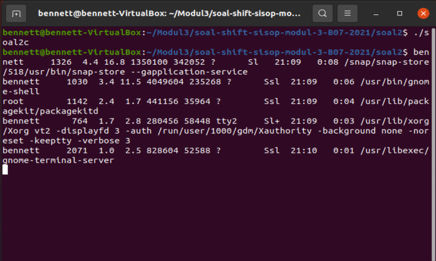

# soal-shift-sisop-modul-3-B07-2021
## Anggota Kelompok
* Christian Bennett Robin 05111940000078
* Zelda Elma Sibuea 05111940000038
* Hanifa Fauziah 05111940000024
## Soal 1

## Soal 2
Crypto (kamu) adalah teman Loba. Suatu pagi, Crypto melihat Loba yang sedang kewalahan mengerjakan tugas dari bosnya. Karena Crypto adalah orang yang sangat menyukai tantangan, dia ingin membantu Loba mengerjakan tugasnya. Detil dari tugas tersebut adalah:

### 2A ###
Membuat program perkalian matrix (4x3 dengan 3x6) dan menampilkan hasilnya. Matriks nantinya akan berisi angka 1-20 (tidak perlu dibuat filter angka).

Pertama-tama inisialisasi key dan array `*arr` agar dapat digunakan dalam shared memory pada program kedua.

```c
 key_t key = 1234;
    int shmid = shmget(key, sizeof(int) * 4 * 6, IPC_CREAT | 0666);

    int *arr = (int *)shmat(shmid, NULL, 0);
```

Lalu sesuai permintaan soal yaitu membuat 2 matrix dengan input dari user untuk perkalian biasa menggunakan for loop. Matrix pertama memiliki besar 4x3, matrix kedua memiliki besar 3x6, dan hasil perkalian matrix memiliki besar 4x6.

```c
printf("This is a program to calculate matrix mutlipication.\nEnter the element of the first matrix: (Matrix[4][3])\n");

    for (int i = 0; i < 4; i++)
    {
        for (int j = 0; j < 3; j++)
        {
            scanf("%d", &mat1[i][j]);
        }
    }

    printf("Enter the element of the second matrix: (Matrix[3][6])\n");

    for (int i = 0; i < 3; i++)
    {
        for (int j = 0; j < 6; j++)
        {
            scanf("%d", &mat2[i][j]);
        }
    }

    int sum = 0;

    for (int i = 0; i < 4; i++)
    {
        for (int j = 0; j < 6; j++)
        {
            for (int k = 0; k < 3; k++)
            {
                sum += (mat1[i][k] * mat2[k][j]);
            }
            matrix[i][j] = sum;
            sum = 0;
        }
    }
```
 
Selanjutnya memasukkan value dari matrix yang telah dikali ke array yang akan digunakan dalam shared memory yaitu matrix `arr`.

```c
for (int i = 0; i < 4; i++)
    {
        for (int j = 0; j < 6; j++)
        {
            arr[i * 6 + j] = matrix[i][j];
            // printf("arr[%d][%d] = %d\n", i, j, arr[i * 6 + j]);
            // sleep(1);
        }
    }
```

Terakhir, jalankan program 2B.
```c
printf("Run program 2.\n");
    for (int i = 30; i > 0; i--)
    {
        printf("%d...\n", i);
        sleep(1);
    }
```


### 2B ###
Membuat program dengan menggunakan matriks output dari program sebelumnya (program soal2a.c) (Catatan!: gunakan shared memory). Kemudian matriks tersebut akan dilakukan perhitungan dengan matrix baru (input user) sebagai berikut contoh perhitungan untuk matriks yang ada. Perhitungannya adalah setiap cel yang berasal dari matriks A menjadi angka untuk faktorial, lalu cel dari matriks B menjadi batas maksimal faktorialnya (dari paling besar ke paling kecil) (Catatan!: gunakan thread untuk perhitungan di setiap cel).

Pertama-tama menginisialisasi key dan arr agar dapat digunakan shared memorynya dari program pertama, lalu assign valuenya pada matrix lokal pada program ke 2.
```c
   key_t key = 1234;
    int shmid = shmget(key, sizeof(int) * 4 * 6, IPC_CREAT | 0666);

    int *arr = (int *)shmat(shmid, NULL, 0);
    
    int matrix[4][6];

    for (int i = 0; i < 4; i++)
    {
        for (int j = 0; j < 6; j++)
        {
            matrix[i][j] = arr[i * 6 + j];
        }
    }
```

Selanjutnya menginputkan matrix untuk melakukan perhitungan angka faktorial sesuai besar matrix hasil perkalian yaitu 4x6.
```c
printf("Input new matrix: (Matrix[4][6])\n");
    for (int i = 0; i < 4; i++)
    {
        for (int j = 0; j < 6; j++)
        {
            scanf("%d", &newMatrix[i][j]);
        }
    }    
```

Lalu untuk setiap kotak matrix inputan, dilakukan perbandingan terhadap matrix hasil perkalian dari program 1 dan dilakukan perhitungan angka faktorialnya sesuai permintaan soal. Ini dilakukan menggunakan thread.
```c
printf("Output matrix: \n");
    for (int i = 0; i < 4; i++)
    {
        for (int j = 0; j < 6; j++)
        {
            if (matrix[i][j] >= newMatrix[i][j])
            {
                // printf("lebih-");
                n = matrix[i][j];
                m = newMatrix[i][j];
                // printf("%d", fact(n - m));
                // hasil[i][j] = fact(n) / fact(n - m);
                // printFact(n, m);
                args.arg1 = n;
                args.arg2 = m;
            }
            else if (newMatrix[i][j] > matrix[i][j])
            {
                // printf("kurang-");
                n = matrix[i][j];
                // printf("%d", fact(n));
                // hasil[i][j] = fact(n);
                // printFact(n, n);
                args.arg1 = n;
                args.arg2 = n;
            }
            else if (matrix[i][j] == 0)
            {
                // hasil[i][j] = 0;
                // printFact(0, 0);
                args.arg1 = 0;
                args.arg2 = 0;

                // printf("0");
            }
            pthread_create(&tid[index], NULL, &funct, (void *)&args);
            pthread_join(tid[index], NULL);
            index++;
            // printf("\t");
            // printf("[%d]\t", hasil[i][j]);
            // printf("[%d]-[%d]\t", matrix[i][j], newMatrix[i][j]);
        }
        printf("\n");
    }
```

Untuk fungsi yang dipakai yaitu pertama `void printFact(int n, int m)`, yaitu untuk melakukan print hasil faktorial, n sebagai batas atasnya dan n-m sebagai batas bawahnya.

```c
void printFact(int n, int m)
{
    int lim = n - m;
    // int count = 0;
    int hasil = 1;
    // printf("lim = %d\n", lim);
    printf("[");
    if (n == 0 || m == 0)
    {
        printf("0");
    }
    else
    {
        for (int i = n; i > 0; i--, n--)
        {
            if (i == lim)
            {
                break;
            }
            else
            {
                // printf("%d", n);
                hasil *= n;
            }
            // if (count != m - 1)
            // {
            //     printf("*");
            //     count++;
            // }
        }
        printf("%d", hasil);
        // printf("\n");
    }
    printf("] ");
}
```

Lalu untuk fungsi yang memanggil fungsi `void printFact(int, int)` tadi dalam bentuk thread merupakan fungsi `void *funct(void arguments)`, yaitu: 

```c
void *funct(void *arguments)
{
    struct arg_struct *args = (struct arg_struct *)arguments;

    printFact(args->arg1, args->arg2);
}
```

Didalam fungsi ini menggunakan struct sebagai argumen karena pada parameter fungsi menggunakan lebih dari 1 variabel, yaitu n dan m. Struct didefinisikan di awal program, yaitu:

```c
struct arg_struct
{
    int arg1;
    int arg2;
};
```


### 2C ###
Karena takut lag dalam pengerjaannya membantu Loba, Crypto juga membuat program (soal2c.c) untuk mengecek 5 proses teratas apa saja yang memakan resource komputernya dengan command “`ps aux | sort -nrk 3,3 | head -5`” (Catatan!: Harus menggunakan IPC Pipes)

Pertama-tama menginisialisasi kedua pipe yang akan digunakan menggunakan: 

```c
int pipe1[2];
int pipe2[2];
```
 
Lalu melakukan pipe dan fork untuk proses pertama.
 
```c
 pipe(pipe1);

    if (fork() == 0)
    {
        //close read dari pipe1
        close(pipe1[0]);
        dup2(pipe1[1], 1);
        //close read dari pipe1
        close(pipe1[1]);

        execlp("/bin/ps", "ps", "aux", NULL);
    }
    // close write dari pipe1
    close(pipe1[1]);
```
 
`close(pipe1[0])` untuk menutup bagian read dari pipe1, lalu `dup2(pipe1[1], 1)` untuk meredirect output proses dari standart output ke bagian write pipe1, dan `close(pipe1[1])` untuk mengclose bagian read dari pipe1. `execlp("/bin/ps", "ps", "aux", NULL)` untuk melakukan proses `ps aux`, dan terakhir bagian write dari pipe1 diclose meggunakan `close(pipe1[1])`.
 
 Lalu lanjut membuat pipe dan fork untuk proses kedua.
 
 ```c
 pipe(pipe2);

    if (fork() == 0)
    {
        //close read dari pipe2
        close(pipe2[0]);

        dup2(pipe1[0], 0);
        //close read dari pipe1
        close(pipe1[0]);
        dup2(pipe2[1], 1);
        //close write dari pipe2
        close(pipe2[1]);

        execlp("/usr/bin/sort", "sort", "-nrk", "3,3", NULL);
    }
    //close read dari pipe1
    close(pipe1[0]);
    //close write dari pipe2
    close(pipe2[1]);
```
 
Mirip dengan bagian sebelumnya, bedanya disini `dup2(pipe1[0], 0)` dilakukan untuk meredirect standart input ke bagian read pipe1, dan `dup2(pipe2[1], 1)` untuk meredirect standard output pipe2 ke bagian write pipe2. Lalu `execlp("/usr/bin/sort", "sort", "-nrk", "3,3", NULL)` untuk melakukan proses `sort -nrk 3,3`, terakhir mengclose bagian read dari pipe1 dan write dari pipe2 agar tidak terjadi memory leak.

Dan dilanjuti dengan pipe dan fork proses terakhir.

```c
if (fork() == 0)
    {
        dup2(pipe2[0], 0);
        //close read dari pipe2
        close(pipe2[0]);

        execlp("/usr/bin/head", "head", "-5", NULL);
    }
    //close read dari pipe2
    close(pipe2[0]);
```

`dup2(pipe2[0], 0)` dilakukan untuk meredirect standard input ke bagian read dari pipe2. Lalu dilanjuti dengan pemanggilan proses menggunakan `execlp("/usr/bin/head", "head", "-5", NULL)` untuk melakukanp proses `head -5`, dan mengclose bagian read dari pipe2.



### Kesulitan ###
Kesulitan yang dialami pada soal ini adalah saat ingin memindahkan isi dari array di program pertama ke program kedua. Hal ini terjadi karena saya salah menginputkan parameter pada salah satu fungsi shared memorynya. Selain itu contoh soal pada soal 2b juga sedikit berbeda dengan yang saya pikirkan, saya pikir yang di print merupakan deret faktorialnya seperti `10*9*8`, ternyata yang diinginkan adalah `720`. 

## Soal 3

Ayub menyarankan untuk membuat sebuah program C agar file-file dapat dikategorikan. Program ini akan memindahkan file sesuai ekstensinya ke dalam folder sesuai ekstensinya yang folder hasilnya terdapat di working directory ketika program kategori tersebut dijalankan. Apabila file tersebut tidak memiliki ekstensi maka file tersebut akan dipindahkan ke folder Unknown. Terdapat tiga mode untuk mengkategorikan file, yaitu -f, *, dan -d.

### Soal 3a ###
Pada soal ini apabila argumennya `"-f"`, program akan mengkategorikan file yang ada pada argumen ke dalam folder berdasarkan ekstensi file tersebut, dan folder berada pada working directory program.
```c
if (strcmp(argv[1],"-f")==0){  
        perintah = argv[1];
        int jumlah = 2;
        int jalankan = 2;
        while (jumlah < argc) {
            pthread_create(&(thread[jumlah]), NULL, myFile, (char*)argv[jumlah]);
            jumlah++;
        }
        while (jalankan < argc) {
            pthread_join(thread[jalankan],NULL);
            jalankan++;
        }
    }
  ```
  Kode di atas akan melakukan looping sebanyak argumen file yang diinput dan memasukkannya ke thread yang dibuat untuk memindahkan file.
  
 ### Soal 3b ###
Pada soal ini, apabila argumen yang diterima adalah `"-d"`, maka program akan mengkategorikan semua file pada folder yang diberikan pada argumen ke dalam folder berdasarkan ekstensi file tersebut, dan folder berada pada working directory program.
```c
else if (strcmp(argv[1],"-d") == 0 ) { 
        perintah = argv[1];
        recursive(argv[2]);
        for(int i=0; i<nomor; i++){
            pthread_create(&(thread[i]), NULL, myFile, (char*)namaFilesNih[i]);
        }
        for(int i=0; i<nomor; i++){
            pthread_join(thread[i],NULL);
        }
        if(keberhasilan == 1){
            printf("Direktori sukses disimpan!\n");
        }else{
            printf("Yah, gagal disimpan :(\n");
        }
    } 
  ```
  
 Fungsi ` recursive` merupakan fungsi untuk traverse direktori adapun kode nya adalah sebagai berikut
   
   ```c
   void recursive(char *basePath) //traverse direktori
{
    char path[1000];
    struct dirent *dp;
    DIR *dir = opendir(basePath);

    if (!dir)
        return;

    while ((dp = readdir(dir)) != NULL)
    {
        if (strcmp(dp->d_name, ".") != 0 && strcmp(dp->d_name, "..") != 0)
        {
            
            strcpy(path, basePath);
            strcat(path, "/");
            strcat(path, dp->d_name);
            strcpy(namaFilesNih[nomor], path);
            nomor++;
            recursive(path);
        }
    }

    closedir(dir);
}
```
* `DIR *dir;` adalah pointer yang menunjuk ke direktori

* `dir = opendir(basePath)` untuk membuka direktori.

* `while( (dp=readdir(dir)))` adalah looping ketika dalam direktori tersebut ada file/folder didalamnya

 ### Soal 3c ###
 Pada soal ini, apabila argumennya `"*"`, program akan mengkategorikan semua file yang ada pada working directory ke dalam folder berdasarkan ekstensinya
 ```c 
 else if (strcmp(argv[1],"*") == 0 ) { 
        perintah = argv[1];
        recursive(".");
        for(int i=0; i<nomor; i++){
            pthread_create(&(thread[i]), NULL, myFile, (char*)namaFilesNih[i]);
        }
        for(int i=0; i<nomor; i++){
            pthread_join(thread[i],NULL);
        }
        if(keberhasilan == 1){
            printf("Direktori sukses disimpan!\n");
        }else{
            printf("Yah, gagal disimpan :(\n");
        }
    }
    
    return 0;
}
```
 ### Soal 3d dan 3e  ###
 Semua file harus berada di dalam folder, jika terdapat file yang tidak memiliki ekstensi, file disimpan dalam folder `“unknown”`. Jika file hidden, masuk folder `“hidden”`.
 ```c
  if(namaFiles[0]=='.'){
        ext = "hidden";
    }else{
        namaFiles = strtok(namaFiles, ".");
        if(strcmp(namaFilesLama, namaFiles)==0){
            ext = "unknown"; 
        }else{
            ext = strtok(NULL, "");
            for (int i=0;i < strlen(ext);i++){
                ext[i] = tolower(ext[i]);
            }
        }
```
Kode-kode di bawah ini merupakan isi dari thread `myFile` yang mengkategorikan suatu file dan untuk mendapatkan nama file beserta ekstensinya. Sementara kode di bawah ini untuk mendapatkan ekstensi dari file tersebut.
```c
void *myFile (void *judulFiles) {
    char *ext;
    char judulBaru[2000];
    char *judulFiles1 = (char*) judulFiles;
    snprintf(judulBaru, sizeof judulBaru, "%s", judulFiles1);
    char *judul = judulFiles;
    char *namaFiles;
    namaFiles = strrchr(judulFiles, '/');
    namaFiles = strtok(namaFiles, "/");
    char namaFilesLama[10000];
    snprintf(namaFilesLama, sizeof namaFilesLama, "%s", namaFiles);
```
Pada soal, karena ekstensi yang diminta tidak case sensitive, maka digunakan kode berikut untuk mengubah apabila terdapat huruf kapital menjadi huruf kecil.
```c
  for (int i=0;i < strlen(ext);i++){
                ext[i] = tolower(ext[i]);
            }
```
Berikut ini jika kita ingin me-*run* perintah `-f`.
<br>


  
  
